# [🌾｜第三章：祝祭と豊穣の黄金穀倉アップデート！](https://github.com/nexusource/Project-NEXUS/blob/main/THE%20WORLD%20OF%20WONDERS%EF%BC%9AWorld%20-%20by%20Project-NEXUS/source/update-v3.md)
説明：MinecraftアクションRPG配布マップ『CerestaFesta』第三都市「ルクスイーファ」の実装、新職業2種、新アイテム約300種、新エンティティ約100種、新スキル約15種、新ボス4体、既存職業の全面改修、等々を含む大型アップデートです！  

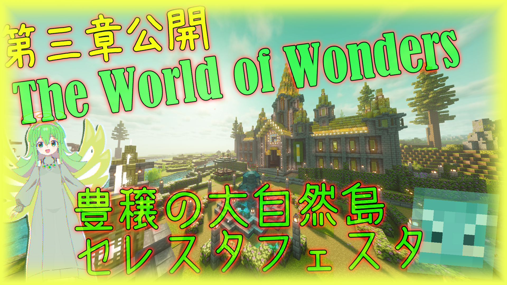
**～三章：祝祭と豊穣の黄金穀倉～**  
物語:あなたは広大な黄金穀倉に到看した。点在する風車と見渡す限りの小麦畑。豊饒の景色の中心にはセレスタ最大都市ルクスイーファがある…その地下は激戦の狩戦場だった。ルクスの黄金麦を取り戻すため軍隊ガエルが巣喰う地下道へと… 

## ❱ 更新【Highlights】
```
- 第三章「黄金穀倉ルクスイーファ」を実装
- 第二章・第一章を全面リワーク（既存の町・敵・ボスを一新）
- 新職業「使役士官」「医工士官」を追加
- ボス複数種の追加及び徹底改良！
- 百種近い新エンティティを追加・更新
- 数百種類の新アイテムを追加
- AnimatedJavaを含む新次元のモデル表現！！！
- 既存職業を全面改修（コンボ技・連携プレイ重視の再設計）
- ガイド機能を強化（案内・チュートリアル要素を大幅補強）
- 追加オプションでプレイスタイルをカスタマイズ可能に
- 大幅な軽量化及び大規模な負荷対策の更新
- Build v0.3.1 for MC1.20.4
```

## ❱ 導入【Introduction】
① 配布サイトから「[CerestaFesta.zip](https://github.com/nexusource/Project-NEXUS/releases/download/twow/CerestaFesta.zip)」をダウンロード！  
② 解凍して下記のPATHに配置。  
③ Minecraft1.20.4で起動して冒険開始！  
```Path
%userprofile%\AppData\Roaming\.minecraft\saves\<world>
```
（以下任意）  
④ resource.zip は解凍してresourcepacksフォルダに配置すると読み込み時間が大幅に短縮します！  
⑤ 軽量化MOD「sodium」を導入するとより軽快に遊べます（要Fabric）  
⑥ 影MOD「ComplementaryUnbound」を導入するとより美しい景色を楽しめます（要Iris）

## ❱ 景色【Gallery】
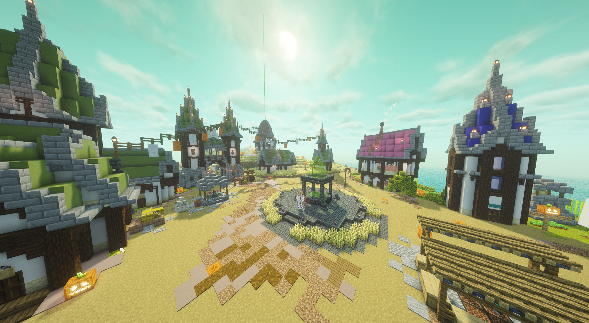

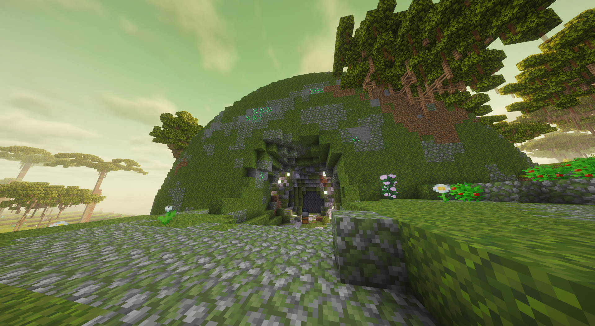
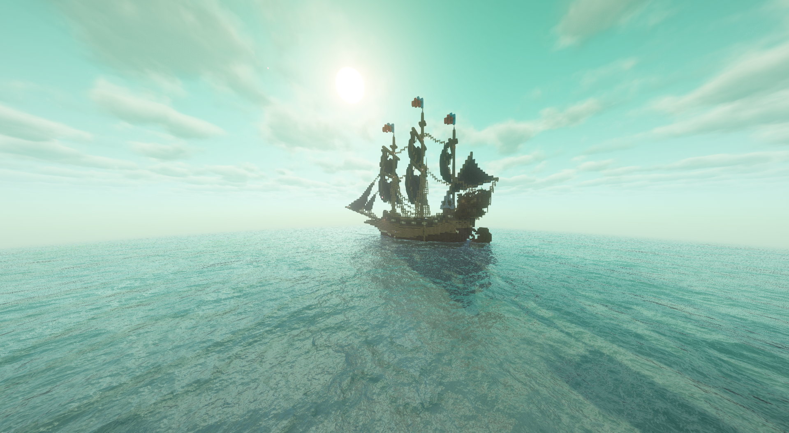
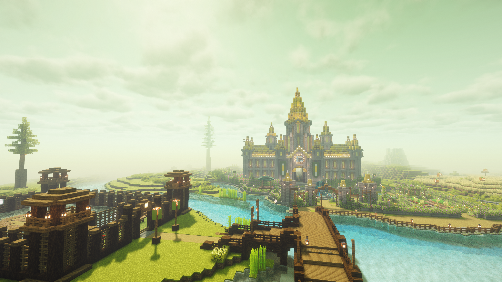
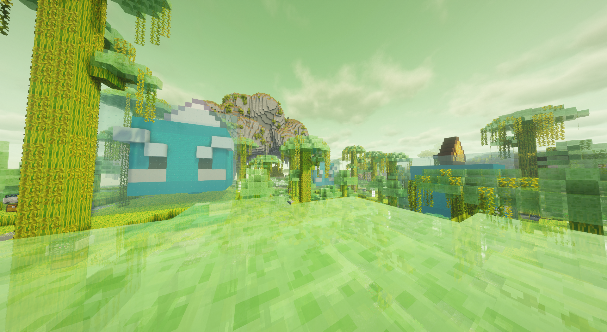
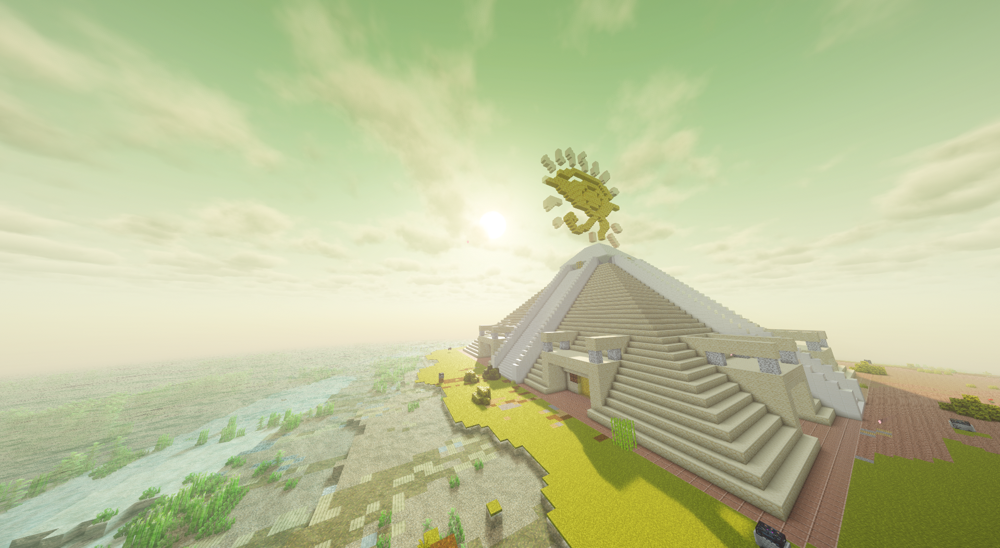
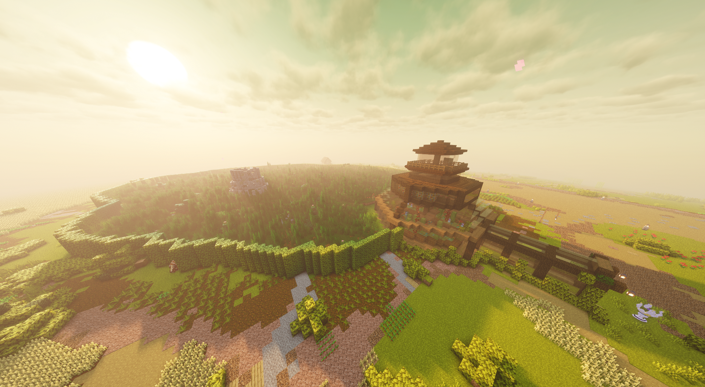
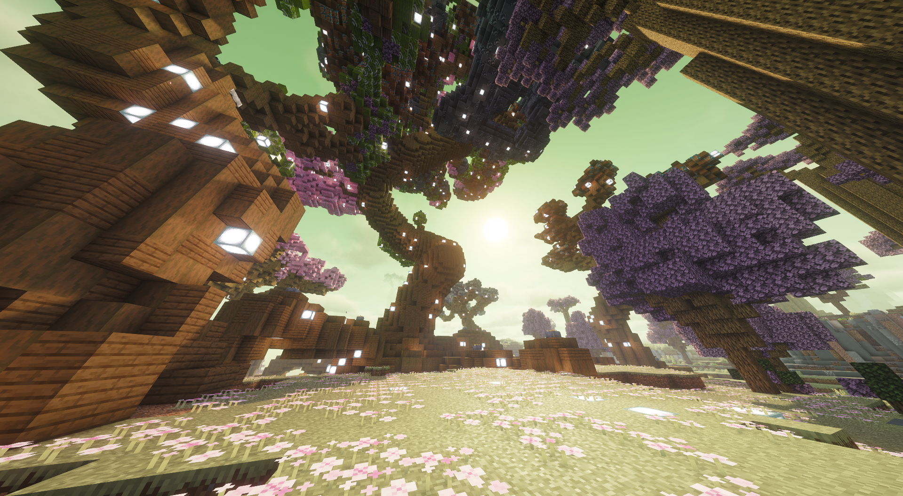

## ❱ 新職業を追加
*戦い方の幅がさらに広がる*

| 職業名 | 概要 |
|---|---|
| 使役士官 | 詳細は近日公開 |
| 医工士官 | 詳細は近日公開 |

## ❱ 既存職業を全面改修
*コンボ技や連携プレイを重視した設計に再構築*

既存の全職業を見直し、コンボ技や仲間との連携プレイを重視した設計に再構築しました。

## ❱ 第一章・第二章を全面リワーク
*始まりの海岸、碧天牧場も生まれ変わる*

既存の町・敵・ボスを一新し、遊び応えを大幅強化しました。
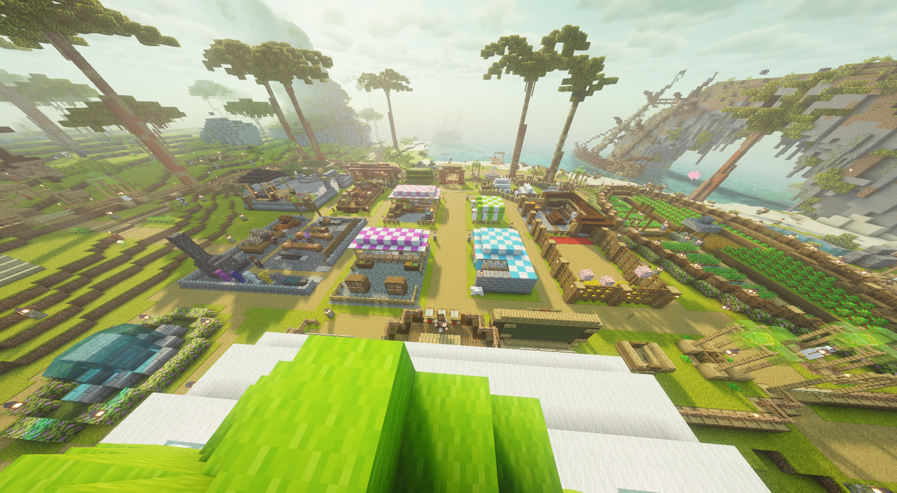
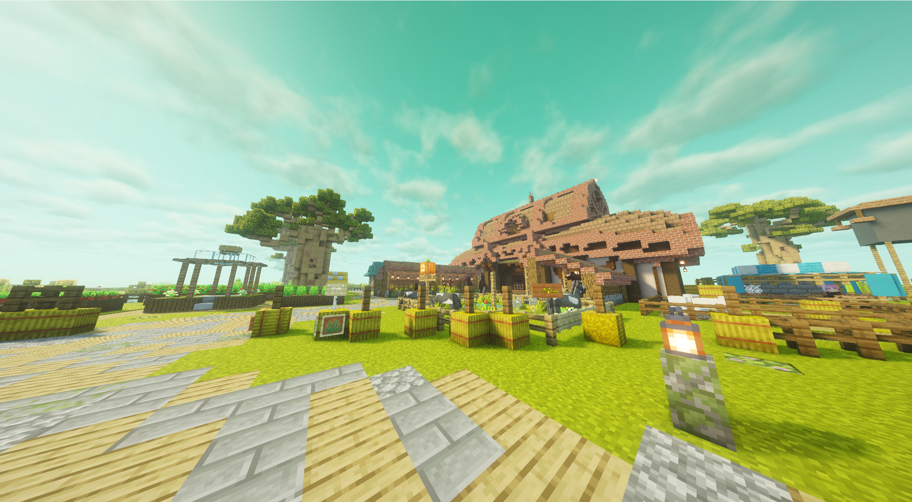

## ❱ ガイド機能を強化
*迷わず冒険できるように*
案内・チュートリアル要素を大幅に補強しました。
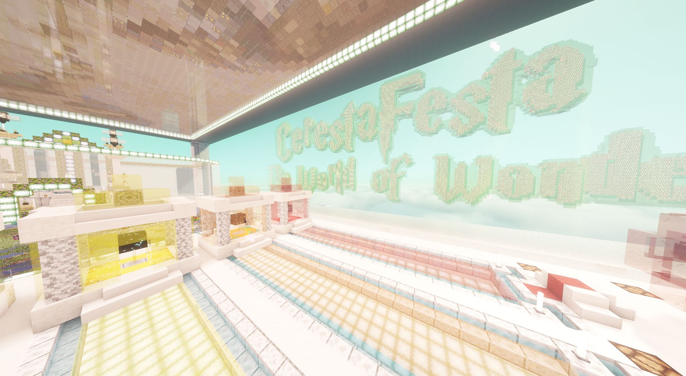

## ❱ 追加オプション
*プレイスタイルのカスタマイズが可能に*

| オプション | 内容 |
|---|---|
| 進捗共有 | マルチプレイヤー間の進捗共有をON/OFF切替 |
| ステータス補助 | ステータス間の補助設定 |
| 防具損壊無効化 | ボス戦での防具損壊を無効化 |
| 全体発光 | 全体発光オプションを追加 |
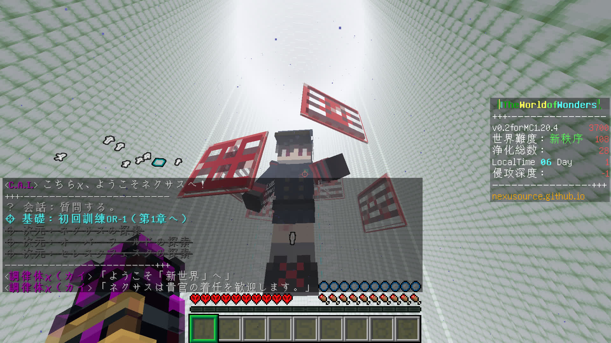

## ❱ 情報【Information】
```
- World:The Celestial Island
- DataPack: 𝐍𝐞𝐨𝐅𝐮𝐧𝐜𝐭𝐢𝐨𝐧𝐬
- ResourcePacks: 𝐍𝐞𝐨𝐓𝐞𝐱𝐭𝐮𝐫𝐞𝐬
- Version: Build v0.3.1 for MC1.20.4
- Copyright: SoraFlete(c)
- Release: 2025/7/26 ~
- Author: NEXUS亜空旅団
```

## ❱ 開発履歴【ChangeLog】
https://discord.com/channels/1066668454192623636/1253389552194949273

## ❱ 連繫【Link of NEXUS】
公式サイト：https://sites.google.com/view/twow/  
README：https://github.com/nexusource/Project-NEXUS/tree/main/THE%20WORLD%20OF%20WONDERS%EF%BC%9AWorld%20-%20by%20Project-NEXUS  
Discord：https://discord.gg/nqx8esTwzS  

## ❱ Download
[__＞＞冒険を始める！＜＜__](https://github.com/nexusource/Project-NEXUS/releases/download/twow/CerestaFesta.zip)

(2026/09/25)
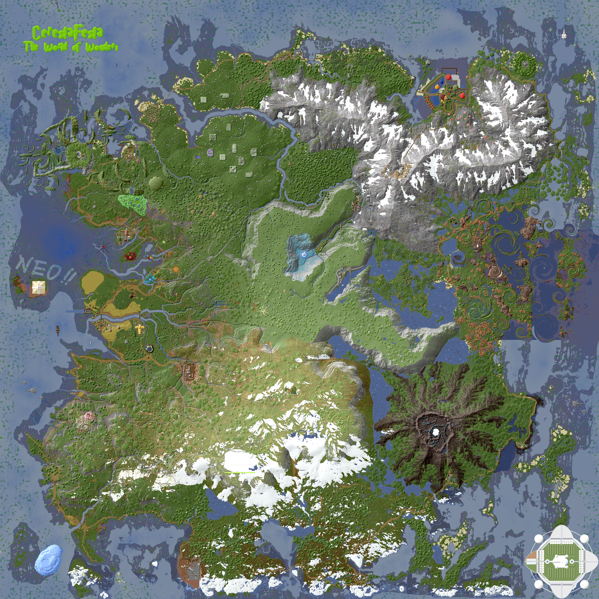
